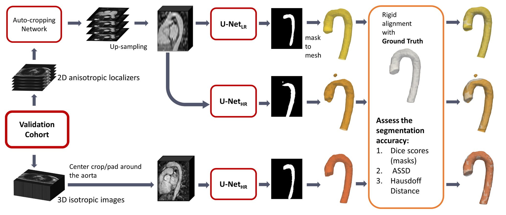

# U-Net_LR

A dilated thoracic aorta can be asymptomatic but poses a significant risk for acute aortic syndrome (AAS), a condition with high mortality. Although prophylactic surgery can prevent AAS, it requires early detection of a dilated aorta.

3D whole heart imaging is effective for identifying AAS by producing high-resolution, 3D isotropic images. However, this technique is time-consuming (~10 minutes), limiting its use for routine screening for the general population.

An alternative approach involves using stacks of 2D trans-axial multi-slice bright blood b-SSFP localizer images, which are routinely performed in nearly every CMR exam. Each slice is typically acquired with a breath hold in a single heartbeat (single shot), enabling full thoracic imaging in under a minute. However, these 2D localizers suffer from low through-plane resolution (with typical slice spacing of 8-12 mm) in the head-foot direction.

Here we present a machine learning method that generates high-resolution 3D aortic segmentations from routine 2D cardiac MR localizers. This approach could reduce the cost and time required for routine screening of aortic aneurysms in clinical care and potentially make it feasible for use in large-scale population studies.

In this repository, you'll find the document that recorded the training details of our ML model, U-Net_LR and a few result examples.The details on the codes in this repository can be found in the paper:

Jiang, Y., Punjabi, K., Pierce, I., Knight, D., Yao, T., Steeden, J., Hughes, A.D., Muthurangu, V. and Davies, R., 2025. A machine learning algorithm for creating isotropic 3D aortic segmentations from routine cardiac MR localizers. Magnetic Resonance Imaging, 115, p.110253. https://www.sciencedirect.com/science/article/pii/S0730725X24002340
